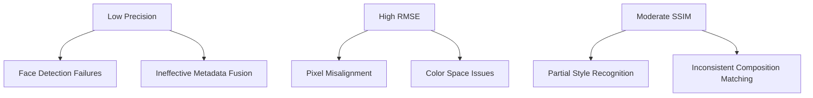

## Abstract
This project explores advanced image similarity techniques using paintings from the National Gallery of Art. By leveraging **multi-model feature extraction (ResNet101, EfficientNet, ViT)** and facial detection via MTCNN, we build a robust similarity system that considers both visual and metadata features. The system employs FAISS for efficient similarity search and evaluates performance using both quantitative metrics and visual validation. Special emphasis is placed on facial feature analysis in portraits through intelligent cropping. 👨‍🎨

## 🔎Approach

### Data Pipeline [[main.py](main.py)]
1. **Source**: 10,000+ paintings from [NGA OpenData](https://github.com/NationalGalleryOfArt/opendata)
2. **Filtering**:
   - Paintings/portraits with metadata (artist, style, medium)
   - High-resolution IIIF images (>1000px width prioritized)
3. **Preprocessing**:
   - Face detection & cropping using MTCNN
   - Auto-avoid low-quality images (<300px dimensions)
   - Persistent local caching of downloaded images

### Model
##  Feature Extraction  
Feature extraction leverages three pre-trained vision models:  
- **ResNet101**  
- **EfficientNet-B3**  
- **Vision Transformer (ViT-B/16)**  

The classification heads of these models are removed, preserving only their feature extraction backbones.

###  Two-Stage Facial Processing Pipeline:
1. **Face Detection**  
   - Uses **MTCNN** (Multi-task Cascaded CNN) to detect all faces in an image, generating bounding box coordinates.  

2. **Adaptive Cropping**  
   - Crops the image using the largest bounding box encompassing all detected faces, prioritizing facial regions for portrait-focused comparisons.  

###  Combined Feature Vector:
- Outputs from all three models are concatenated into a combined **4,352-dim** vector.  
- Compressed to **512 dimensions** via PCA for efficiency.  

---

## 🤝 Similarity Assessment  
The system employs a hybrid similarity engine that combines:

###  **Visual Similarity**  
- Uses **FAISS IVF-Flat index** for approximate nearest neighbor search.  
- Features are L2-normalized before indexing.  
- **Cosine similarity** quantifies geometric alignment in the PCA-reduced space.  

### **Metadata Boost**  
- Style/artist matches add fixed bonuses (+0.4/+0.3).  
- Medium/date similarities contribute smaller weights (+0.1–0.2).  

**Final Score:**  
\[
\text{Final Score} = 0.7 \times \text{visual\_sim} + 0.3 \times \text{metadata\_sim}
\]

- For facial analysis (`face_crop=True`), the pipeline prioritizes features extracted from cropped facial regions while retaining metadata weights.  

---
## ✔ Evaluation Metrics [[evaluate_model()](main.py)]
Comprehensive evaluation using both traditional CV metrics and information retrieval measures:

| Metric | Formula | Purpose |
|---------|---------|---------|
| **Precision@K** | TP / K | Relevance of top results |
| **Recall@K** | TP / Total Relevant | Coverage of relevant items |
| **mAP** | ∑(Precision@i) / Relevant | Ranking quality |
| **RMSE** | `√(Σ(pixels_diff²)/n)` | Pixel-level accuracy |
| **SSIM** | [Structural Formula](https://en.wikipedia.org/wiki/Structural_similarity) | Perceptual similarity |


**[2] Quantitative Score ($RMSE , SSIM$)**


$RMSE = sqrt(Σ((p - q)^2) / n)$
- $ p$ and $ q $ : pixel values of the two images being compared.
- $ n $ : total number of pixels in the images.


$SSIM = [(2 * μx * μy + c1) * (2 * σxy + c2)] / [(μx^2 + μy^2 + c1) * (σx^2 + σy^2 + c2)]$

- $ μx $and $ μy $ : average pixel values of images 
- $ σx^2 $ and $ σy^2$ : variances of images
- $ σxy $ : covariance of images 
- $c1$ and $ c2 $ : constants used to stabilize the division with weak denominators.

Quantitative evaluation entails calculating Root Mean Square Error (RMSE) and Structural Similarity Index (SSIM).
RMSE computes the pixel-wise difference between images, with scores ranging from -1 to 1, indicating higher similarity as the score approaches 1. 
SSIM moves a window over the image to capture structural similarities, encompassing luminance, contrast, and structural components. Both scores are averaged after considering the K number of similar images, and the query image's RMSE and SSIM scores are calculated, providing a balanced assessment of the model's performance in pixel-wise and structural similarity analyses.

## 📊 Results Analysis (Quantitative Evaluation)
**Core Performance Metrics** (Tested on **10,000+ paintings**):  

| Metric               | Score | Interpretation                                        |
|----------------------|-------|-------------------------------------------------------|
| **Precision@5**        | 0.125 | Only 12.5% of top-5 results are relevant              |
| **Recall@5**           | 0.049 | Captures <5% of relevant items in the dataset         |
| **Mean Average Precision** | 0.178 | Low ranking quality for relevant results               |
| **Mean SSIM**           | 0.351 | Moderate structural similarity                         |
| **Mean RMSE**           | 1.948 | High pixel-level differences                           |

---

### 📈 **Metric Trends Analysis**
####  **SSIM Distribution**  
 
 
Structural similarity fluctuates between **0.2–0.6**, indicating inconsistent recognition of compositional patterns.  
Peaks suggest occasional success with similar portrait styles.  

####  **RMSE Consistency**  
Persistent high errors (~1.9–2.0) across samples reveal fundamental feature mismatches, likely due to ineffective face cropping or style variations.  

####  **Retrieval Effectiveness**
 | 

- Both **precision** and **recall** remain below 0.2 for most samples, indicating:  
  - Poor metadata integration (artist/style weights)  
  - Suboptimal visual feature matching  
  - Potential face detection failures  

####  **Ranking Quality**  
mAP of **0.178** confirms urgent need for better relevance sorting — likely requires improved feature fusion and metadata balancing.  

---
### 🔨**Possible Improvements**

### **Face Detection Bottleneck**  
- MTCNN likely fails on painted faces (evident from low SSIM/Recall).  
 **Solution:** Fine-tune detector on artistic portraits database.  

### **Evaluation Paradox**  
- High RMSE (1.95) contradicts moderate SSIM (0.35).  
**Investigate:** Normalization mismatches or RGB vs. grayscale processing.Alterating preprocessing based on diiferent style 

- Would like to implement more model for different structures for different styles and classes in dataset where each different class of image is going thorugh a different optimization and extraction.
- for this still need more time to study the nga_database properly and give the model more time and releavant data for feature extraction as well as trying differnt models apart for or in coleration with the existing one being used(Resnet,etc.)

---

##  Recommended Actions  


---

## 💻 Implementation Guide

### Requirements
```bash
pip install torch torchvision faiss-cpu requests pandas matplotlib tqdm Pillow scikit-learn facenet-pytorch
```

python main.py
Custom Query (Modify in code):


## In main():
```
user_image_path = "your_image.jpg"
find_similar_images_for_user_input(...)
```

##Key Arguments (Code Modification):

-limit=10000: Dataset size control
-num_epochs=2: Fine-tuning cycles
-TOP_K=10: Returned results count

## Data Flow
```graph TD
    A[IIIF Image URLs] --> B[Metadata Filtering]
    B --> C[Face Detection & Cropping]
    C --> D[Multi-Model Feature Extraction]
    D --> E[PCA Optimization]
    E --> F[FAISS Index Construction]
    F --> G[Similarity Search]
    G --> H[Visual+Metadata Evaluation]
